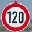

# **Traffic Sign Recognition** 

Yangchun Luo

Oct 20, 2017

This is the assignment for Udacity's Self-Driving Car Term 1 Project 2.

---

**Build a Traffic Sign Recognition Project**

The goals / steps of this project are the following:

* Load the data set (see below for links to the project data set)
* Explore, summarize and visualize the data set
* Design, train and test a model architecture
* Use the model to make predictions on new images
* Analyze the softmax probabilities of the new images
* Summarize the results with a written report 

---
### Writeup / README

#### 1. Provide a Writeup / README that includes all the rubric points and how you addressed each one. You can submit your writeup as markdown or pdf. You can use this template as a guide for writing the report. The submission includes the project code.

You're reading it! and here is a link to my [project code](https://github.com/yangchunluo/CarND-Traffic-Sign-Classifier-Project/blob/master/Traffic_Sign_Classifier.ipynb)

### Data Set Summary & Exploration

#### 1. Provide a basic summary of the data set. In the code, the analysis should be done using python, numpy and/or pandas methods rather than hardcoding results manually.

I used the numpy library to calculate summary statistics of the traffic
signs data set:

* The size of training set is 34799
* The size of the validation set is 4410
* The size of test set is 12630
* The shape of a traffic sign image is 32x32x3
* The number of unique classes/labels in the data set is 43

#### 2. Include an exploratory visualization of the dataset.

From each dataset (training, validation, and test), I randomly plotted an image and printed its associated text.

Also for each dataset, I plotted the histogram of the label distribution. All the datasets follow a similar distribution, although certain labels have higher coverage than others. 

### Design and Test a Model Architecture

#### 1. Describe how you preprocessed the image data. What techniques were chosen and why did you choose these techniques? Consider including images showing the output of each preprocessing technique. Pre-processing refers to techniques such as converting to grayscale, normalization, etc. (OPTIONAL: As described in the "Stand Out Suggestions" part of the rubric, if you generated additional data for training, describe why you decided to generate additional data, how you generated the data, and provide example images of the additional data. Then describe the characteristics of the augmented training set like number of images in the set, number of images for each class, etc.)

I decided not to convert the image to greyscale since additional color information may be relevant to the model.

The only preprocessing step is normalization. I chose to do (pixel-128)/128 for the sake of simplicity. Here are the image before and after the normalization.

#### 2. Describe what your final model architecture looks like including model type, layers, layer sizes, connectivity, etc.) Consider including a diagram and/or table describing the final model.

My final model consisted of the following layers:

| Layer         		|     Description	        | 
|:-----------------:|:---------------------------------------------:| 
| Input         		| 32x32x3 RGB image   | 
| Convolution 5x5   | 1x1 stride, valid padding, outputs 28x28x6|
| RELU					|						|
| Max pooling	      	| 2x2 stride,  outputs 14x14x6 |
| Convolution 5x5   | 1x1 stride, valid padding, outputs 10x10x16|
| RELU					|						|
| Max pooling	      	| 2x2 stride,  outputs 5x5x16 |
| Fully connected   | input 400 (5x5x16), output 120 |
| RELU              |                   |
| Dropout           | rate 0.5 |
| Fully connected   | input 120, output 84 |
| RELU              |                   |
| Dropout           | rate 0.5 |
| Fully connected   | input 84, output 43 (number of classes) |

#### 3. Describe how you trained your model. The discussion can include the type of optimizer, the batch size, number of epochs and any hyperparameters such as learning rate.

To train the model, I used the ADAM optimizer. The initial learning rate is 0.001, with exponential decay, in the rate of 0.96 per epoch. The batch size is 128. Initially I trained with 10 epochs. By observing that the validation accuracy is still increasing at the end of 10 epochs, I trained for another 10 epochs, total of 20 epochs.

#### 4. Describe the approach taken for finding a solution and getting the validation set accuracy to be at least 0.93. Include in the discussion the results on the training, validation and test sets and where in the code these were calculated. Your approach may have been an iterative process, in which case, outline the steps you took to get to the final solution and why you chose those steps. Perhaps your solution involved an already well known implementation or architecture. In this case, discuss why you think the architecture is suitable for the current problem.

My final model results were:

- training set accuracy of 99.3%
- validation set accuracy of 96.1% 
- test set accuracy of 93.8%

I started with basic LeNet CNN architecture. It was chosen because it is proven to work with the handle written letters. Traffic sign recognition is not fundamentally different from handle written letters. CNN architecture can capture the local patterns through convolution and gradually build up the depth of dimension by learning more and more complex features.
 
During training, I observed that after 10 epochs, there is quite a bit of gap between training and validation set accuracy: while the training accuracy is 98.2%, the validation accuracy plateaued at only 87.4%. This indicates that the model is overfitting the training data.

My solution was to add a dropout layer (keep_prob=0.5) after the first fully-connected layer. Dropout can force the network to learn redundant features and mitigate overfitting. This improved the validation accuracy a bit, but still not to the point of satisfaction.

I further added another dropout layer (keep_prob=0.5) after the second fully-connected layer. Due to this addition, I increased the number of training epochs. The fixed learning rate of 0.001 is too high in the later phase of the training. So I employed an exponential decay on the learning rate, of 0.96 per each epoch.

After these changes, the gap between training and validation accuracy is reduced significantly. After 10 epochs, the validation accuracy still increases steadily around 93%. I increased the number of epochs to 20 and the validation accuracy plateaued around 96%.

### Test a Model on New Images

#### 1. Choose five German traffic signs found on the web and provide them in the report. For each image, discuss what quality or qualities might be difficult to classify.

Here are five German traffic signs that I found on the web:

    

#### 2. Discuss the model's predictions on these new traffic signs and compare the results to predicting on the test set. At a minimum, discuss what the predictions were, the accuracy on these new predictions, and compare the accuracy to the accuracy on the test set (OPTIONAL: Discuss the results in more detail as described in the "Stand Out Suggestions" part of the rubric).

Here are the results of the prediction:

| Image                 |     Prediction  | 
|:---------------------:|:---------------------------------------------:| 
| Children crossing     | Slippery road   | 
| Road work             | Road work|
| Roundabout mandatory  | Roundabout mandatory
| 50 km/h	      		    | 50 km/h		|
| 120 km/h              | 20 km/h		|

The model was able to correctly guess 3 of the 5 traffic signs, which gives an accuracy of 60%. This is not on par with the test set, which has the accuracy of 93.8%. While using five pictures to compare with the test set (which has over 10k images) has huge variance, the discrepancy will be discussed in the next section.

#### 3. Describe how certain the model is when predicting on each of the five new images by looking at the softmax probabilities for each prediction. Provide the top 5 softmax probabilities for each image along with the sign type of each probability. (OPTIONAL: as described in the "Stand Out Suggestions" part of the rubric, visualizations can also be provided such as bar charts)

The code for making predictions on my final model is located under the section of "Output Top 5 Softmax Probabilities For Each Image Found on the Web" in the Ipython notebook.

For the first image, the model is uncertain. The correct label (Children crossing) has the second highest probability. This is mis-predicted as "Slippery road" probably due to the similarity of the curves in the sign. The top five softmax probabilities are:

| Probability         	|     Prediction	   | 
|:---------------------:|:---------------------------------------------:| 
| 0.5617 | Slippery road |
| 0.2833 | Children crossing |
| 0.1242 | Beware of ice/snow |
| 0.0107 | Bicycles crossing |
| 0.0090 | Dangerous curve to the left|

For the second image, the model is quite certain and the prediction is correct. The top five softmax probabilities are:

| Probability         	|     Prediction	   | 
|:---------------------:|:---------------------------------------------:| 
| 1.0000  | Road work |
| 0.0000  | Dangerous curve to the right |
| 0.0000  | Beware of ice/snow |
| 0.0000  | General caution |
| 0.0000  | Traffic signals |

For the third image, the model is quite certain and the prediction is correct. The top five softmax probabilities are:

| Probability         	|     Prediction	   | 
|:---------------------:|:---------------------------------------------:| 
| 1.0000  | Roundabout mandatory |
| 0.0000  | Keep left |
| 0.0000  | Turn right ahead |
| 0.0000  | Go straight or left |
| 0.0000  | Keep right |

For the fourth image, the model is quite certain and the prediction is correct. The top five softmax probabilities are:

| Probability         	|     Prediction	   | 
|:---------------------:|:---------------------------------------------:|
| 1.0000  | Speed limit (50km/h) |
| 0.0000  | Speed limit (80km/h) |
| 0.0000  | Speed limit (30km/h) |
| 0.0000  | Speed limit (60km/h) |
| 0.0000  | Speed limit (100km/h) |

For the fifth image, the model is uncertain. It is mis-predicted as 20km/h in fact the correct label is 120km/h. This is probably due to the similarity between general structure of speed limit signs but differing only the number inside. The correct label has the fourth highest probability. The top five softmax probabilities are:

| Probability         	|     Prediction	   | 
|:---------------------:|:---------------------------------------------:|
| 0.4939 | Speed limit (20km/h) |
| 0.3905 | Speed limit (30km/h) |
| 0.1011 | Speed limit (70km/h) |
| 0.0144 | Speed limit (120km/h) |
| 0.0000 |Speed limit (50km/h) |

### (Optional) Visualizing the Neural Network (See Step 4 of the Ipython notebook for more details)
#### 1. Discuss the visual output of your trained network's feature maps. What characteristics did the neural network use to make classifications?

